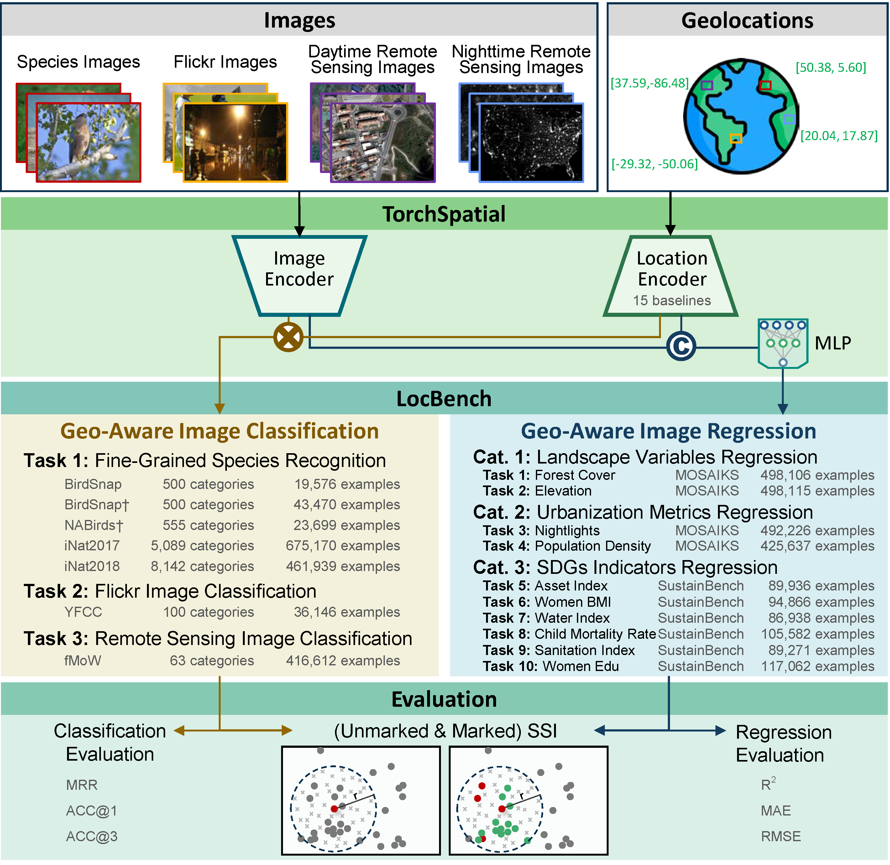
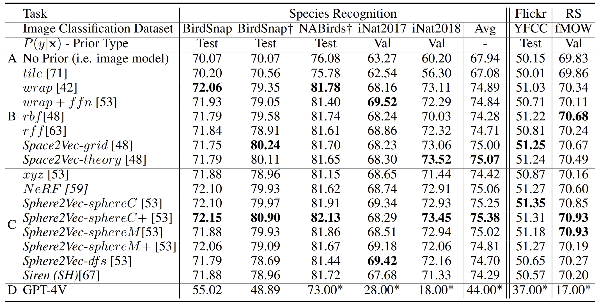
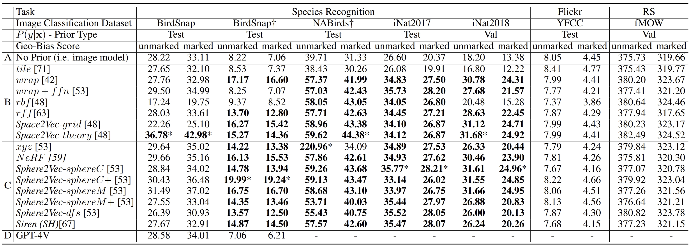
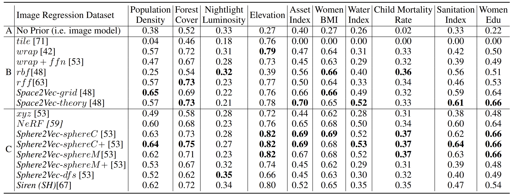

# TorchSpatial: A Location Encoding Framework and Benchmark for Spatial Representation Learning

[](https://arxiv.org/abs/2406.15658)
[](https://openreview.net/forum?id=DERtzUdhkk#discussion)


## Overview
TorchSpatial offers a comprehensive framework and benchmark suite designed to advance spatial representation learning (SRL). It supports the development and evaluation of location encoders using extensive benchmarks and innovative evaluation metrics. The documentation is [here](https://torchspatial.readthedocs.io/en/latest/).

## Features
- **Unified Framework**: Integrates 15 recognized location encoders to enhance scalability and reproducibility.
- **LocBench Benchmark**: Includes 17 datasets for geo-aware image classification and regression, enabling thorough performance assessments across various geographic distributions.
- **Geo-Bias Score**: A set of novel metrics to evaluate model performance and geographic bias, promoting spatial fairness in GeoAI applications.

## Availability
Access the TorchSpatial framework, LocBench benchmarks, and evaluation metrics on GitHub: [TorchSpatial GitHub Repository](https://github.com/seai-lab/TorchSpatial).

## Overall Framework


## Environment Settings  
Please ensure that the package versions used in your environment match those specified in [requirements.txt](https://github.com/seai-lab/TorchSpatial/blob/main/main/requirements.txt).

## Code Execution
Example bash scripts for running the code are available in the [main/run_bash](https://github.com/seai-lab/TorchSpatial/tree/main/main/run_sh) folder. A detailed tutorial can be found in the following Jupyter notebook: [tutorial.ipynb](https://github.com/seai-lab/TorchSpatial/blob/main/main/tutorial.ipynb).  


## Dataset Download Instructions  
1. You can **download the dataset** from the following DOI link: [Download Data](https://doi.org/10.6084/m9.figshare.26026798). As we have performed data cleaning and preprocessing, please use the provided dataset to ensure the code functions correctly.
2. Please **update the paths** in [paths.py](https://github.com/seai-lab/TorchSpatial/blob/main/main/paths.py) to reflect the locations of the datasets on your system accurately.

## Geo-Bias Score 
We have another repository specifically designed for geo-bias calculations: [PyGBS](https://github.com/seai-lab/PyGBS/tree/main). In this repository, we support more geo-bias scores than described in the TorchSpatial paper. 
 
## Results
Table 1: The Top1 classification accuracy of different models on 7 geo-aware image classification datasets in LocBench benchmark. GPT-4V is tested with zero-shot settings, and * indicates that we resample 100 images from each dataset's test/validation set except BirdSnap and Birdsnap† whose whose test sets are used for evaluation. "Avg" column indicates the average performance of each model on all five species recognition datasets. **Bold** indicates the best models in Group B and C.
<div align="center">
  
</div>

Table 2: The Geo-bias scores of all location encoders across 7 geo-aware image classification datasets. "unmarked" represents the unmarked SSI geo-bias score, and "marked" represents the marked SSI geo-bias score. Both geo-bias scores are computed at the scale of 100km and using a 4-nearest-neighbor weight matrix. **Bold** numbers indicate that the scores that are significantly larger (>30\%) than the "No Prior" model (i.e., the location-unaware model); * indicates the scores that are the largest among all models for this dataset. For GPT-4V, we do not report the geo-bias scores for larger datasets because our evaluation is limited to small subsets from these data (e.g., iNaturalist), due to budget constraints. Consequently, these geo-bias scores are not directly comparable to those of other studies.


Table 3: The R square of different models on 10 geo-aware image regression datasets in LocBench benchmark. Same format as Table 1.
<div align="center">
  
</div>

Table 4: The Geo-bias scores of all location encoders across 4 geo-aware image regression datasets. Same format as Table 2.
<div align="center">
  
</div>

Please refer to the appendix of our [TorchSpatial paper](https://openreview.net/pdf?id=DERtzUdhkk) for more results.

The average runtime for BirdSnap, BirdSnap†, NABirds†, and YFCC is within 5 minutes, and 10 to 20 minutes for iNat2017, iNat2018, and fMow.
The number of training for each model on each dataset is one. Same as evaluation.
All our experiments were conducted on a Ubuntu workstation equipped with 4 NVIDIA RTX A5500 GPUs each of which has 24 GB memory. 


### Reference
If you find our work useful in your research please consider citing our [TorchSpatial paper](https://openreview.net/pdf?id=DERtzUdhkk): 
```
@inproceedings{wu2024torchspatial,
  title={TorchSpatial: A Location Encoding Framework and Benchmark for Spatial Representation Learning},
  author={Nemin Wu and Qian Cao and Zhangyu Wang and Zeping Liu and Yanlin Qi and Jielu Zhang and Joshua Ni and X. Angela Yao and Hongxu Ma and Lan Mu and Stefano Ermon and Tanuja Ganu and Akshay Nambi and Ni Lao and Gengchen Mai},
  booktitle={The Thirty-eight Conference on Neural Information Processing Systems Datasets and Benchmarks Track},
  year={2024},
  url={https://openreview.net/forum?id=DERtzUdhkk}
}
```

If you use Sphere2Vec location encoder, please cite [our ISPRS PHOTO 2023 paper](https://www.researchgate.net/publication/371964548_Sphere2Vec_A_General-Purpose_Location_Representation_Learning_over_a_Spherical_Surface_for_Large-Scale_Geospatial_Predictions):
```
@article{mai2023sphere2vec,
  title={Sphere2Vec: A General-Purpose Location Representation Learning over a Spherical Surface for Large-Scale Geospatial Predictions},
  author={Mai, Gengchen and Xuan, Yao and Zuo, Wenyun and He, Yutong and Song, Jiaming and Ermon, Stefano and Janowicz, Krzysztof and Lao, Ni},
  journal={ISPRS Journal of Photogrammetry and Remote Sensing},
  year={2023},
  vol={202},
  pages={439-462},
  publisher={Elsevier}
}
```

If you use grid location encoder, please also cite [our ICLR 2020 paper](https://openreview.net/forum?id=rJljdh4KDH) and [our IJGIS 2022 paper](https://www.tandfonline.com/doi/full/10.1080/13658816.2021.2004602):
```
@inproceedings{mai2020space2vec,
  title={Multi-Scale Representation Learning for Spatial Feature Distributions using Grid Cells},
  author={Mai, Gengchen and Janowicz, Krzysztof and Yan, Bo and Zhu, Rui and Cai, Ling and Lao, Ni},
  booktitle={International Conference on Learning Representations},
  year={2020},
  organization={openreview}
}

@article{mai2022review,
  title={A review of location encoding for GeoAI: methods and applications},
  author={Mai, Gengchen and Janowicz, Krzysztof and Hu, Yingjie and Gao, Song and Yan, Bo and Zhu, Rui and Cai, Ling and Lao, Ni},
  journal={International Journal of Geographical Information Science},
  volume={36},
  number={4},
  pages={639--673},
  year={2022},
  publisher={Taylor \& Francis}
}
```
If you use the unsupervised learning function, please also cite [our ICML 2023 paper](https://gengchenmai.github.io/csp-website/). Please refer to [our CSP webite](https://gengchenmai.github.io/csp-website/) for more detailed information.  
```
@inproceedings{mai2023csp,
  title={CSP: Self-Supervised Contrastive Spatial Pre-Training for Geospatial-Visual Representations},
  author={Mai, Gengchen and Lao, Ni and He, Yutong and Song, Jiaming and Ermon, Stefano},
  booktitle={International Conference on Machine Learning},
  year={2023},
  organization={PMLR}
}
```

### License
Our code is under MIT license. All data products created through our work that are not covered under upstream licensing agreements are available via a CC BY-NC 4.0 license. All upstream data use restrictions take precedence over this license.
