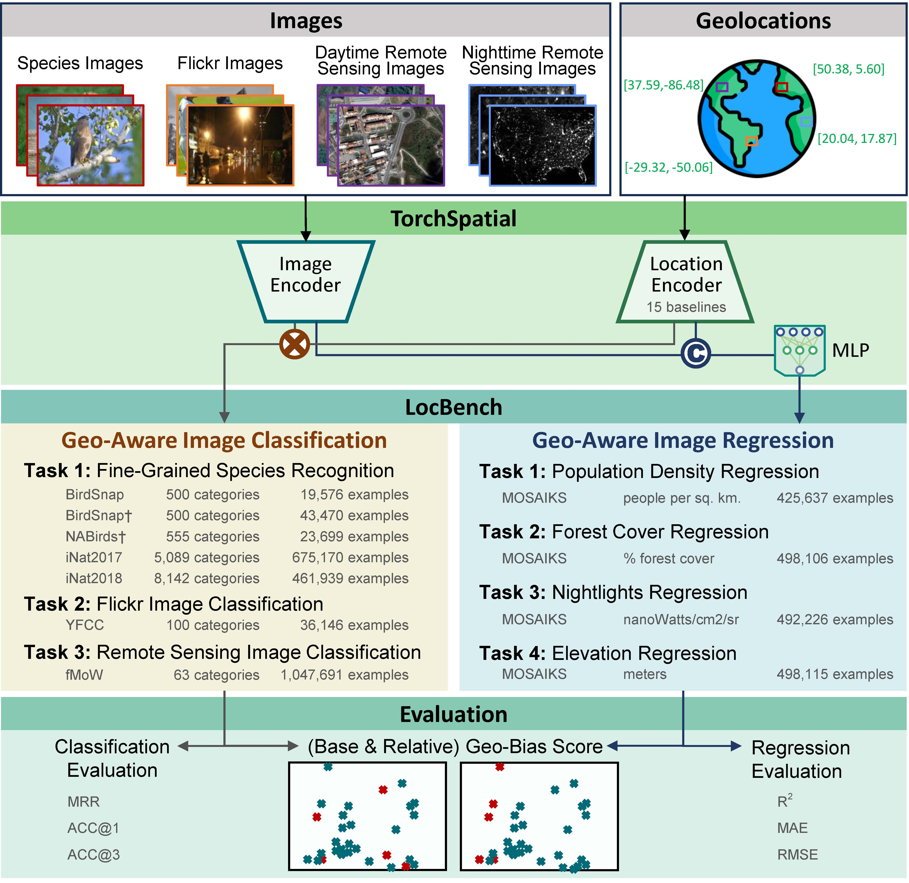

# TorchSpatial: A Location Encoding Framework and Benchmark for Spatial Representation Learning
🚧 Constructing...




## Data Download Instructions
The data can be downloaded from the following DOI link:
[Download Data](https://doi.org/10.6084/m9.figshare.26026798)

Data should be organized following the ..

## Code Execution
The example bash files for running the codes can be found in main/run_bash folder


## Image Datasets

### BirdSnap
An image dataset about bird species based on BirdSnap dataset (Berg et al., 2014) with location annotations by (Aodha et al., 2019). It consists of 19576 images of 500 bird species that are commonly found in North America.  This dataset and the other two following are widely used by multiple studies (Aodha et al., 2019; Mai et al., 2020, 2023) to demonstrate location encoder's capacity to significantly increase the fine-grained species classification accuracy. 

### BirdSnap†
An enriched BirdSnap dataset constructed by (Aodha et al., 2019) by simulating locations, dates, and photographers from the eBrid dataset (Sullivan et al., 2009), containing 43470 images of 500 categories. 

### NABirds†
Another image dataset about North American bird species constructed by (Aodha et al., 2019) 
based on the NABirds dataset (Van Horn et al., 2015), the location metadata were also simulated from the eBrid dataset (Sullivan et al., 2009). It contains 23699 images of 555 bird species categories. 

**Download**: [NABirds Dataset](https://dl.allaboutbirds.org/nabirds)

### iNat2017
The worldwide species recognition dataset used in the iNaturalist 2017 challenges (Van Horn et al., 2018) with 675170 images and 5089 unique categories. We add the location information retroactively provided by iNaturalist 2021. Although its spatial distribution focuses on North America and Europe, it still covers the entire globe, which makes it one of the most spatially extensive and species-rich image dataset known to us.

**Validation Split**: [iNat2017 Validation Split](https://github.com/visipedia/inat_comp/blob/master/2017/README.md)

### iNat2018
The worldwide species recognition dataset used in the iNaturalist 2018 challenges (Van Horn et al., 2018) with 461939 images and 8142 unique categories. Although the original competition didn't provide coordinates, we add them to our benchmark as additional information from the same data source of iNaturalist 2021. It has a similar spatial distribution with iNat2017, covering all continents. We choose these two datasets to evaluate location encoder's capacity to improve fine-grained species classification performance at the global level.

**Validation Split**: [iNat2018 Validation Split](https://github.com/visipedia/inat_comp/tree/master/2018)

### YFCC
YFCC100M-GEO100 dataset, an image dataset derived from Yahoo Flickr Creative Commons 100M dataset and was annotated by (Tang et al., 2015), containing 88986 images over 100 everyday object categories with location annotations. Here, we denote this dataset as YFCC. YFCC is a comprehensive public dataset with images across the United States. Despite the relatively limited geographic coverage, we employ this dataset to measure location encoder's capacity for multifaceted image classification in addition to domain-specific image classification.

**Download**: [YFCC Dataset](https://github.com/visipedia/fg_geo)

### fMoW
Functional Map of the World dataset (denoted as fMoW) (Christie et al., 2018) is a remote sensing (RS) image classification dataset, containing RS images with diverse land use types collected all over the world. It is composed of about 363K training and 53K validation remote sensing images which are classified into 62 different land use types. We use the fMoWrgb version of the fMoW dataset which are JPEG compressed version of these RS images with only the RGB bands.

**Download**: [fMoW Dataset](https://github.com/fMoW/dataset)


### Reference
If you find our work useful in your research please consider citing [our ISPRS PHOTO 2023 paper](https://www.researchgate.net/publication/371964548_Sphere2Vec_A_General-Purpose_Location_Representation_Learning_over_a_Spherical_Surface_for_Large-Scale_Geospatial_Predictions).  
```
@article{mai2023sphere2vec,
  title={Sphere2Vec: A General-Purpose Location Representation Learning over a Spherical Surface for Large-Scale Geospatial Predictions},
  author={Mai, Gengchen and Xuan, Yao and Zuo, Wenyun and He, Yutong and Song, Jiaming and Ermon, Stefano and Janowicz, Krzysztof and Lao, Ni},
  journal={ISPRS Journal of Photogrammetry and Remote Sensing},
  year={2023},
  vol={202},
  pages={439-462},
  publisher={Elsevier}
}
```
If you use grid location encoder, please also cite [our ICLR 2020 paper](https://openreview.net/forum?id=rJljdh4KDH) and [our IJGIS 2022 paper](https://www.tandfonline.com/doi/full/10.1080/13658816.2021.2004602):
```
@inproceedings{mai2020space2vec,
  title={Multi-Scale Representation Learning for Spatial Feature Distributions using Grid Cells},
  author={Mai, Gengchen and Janowicz, Krzysztof and Yan, Bo and Zhu, Rui and Cai, Ling and Lao, Ni},
  booktitle={International Conference on Learning Representations},
  year={2020},
  organization={openreview}
}

@article{mai2022review,
  title={A review of location encoding for GeoAI: methods and applications},
  author={Mai, Gengchen and Janowicz, Krzysztof and Hu, Yingjie and Gao, Song and Yan, Bo and Zhu, Rui and Cai, Ling and Lao, Ni},
  journal={International Journal of Geographical Information Science},
  volume={36},
  number={4},
  pages={639--673},
  year={2022},
  publisher={Taylor \& Francis}
}
```
If you use the unsupervised learning function, please also cite [our ICML 2023 paper](https://gengchenmai.github.io/csp-website/). Please refer to [our CSP webite](https://gengchenmai.github.io/csp-website/) for more detailed information.  
```
@inproceedings{mai2023csp,
  title={CSP: Self-Supervised Contrastive Spatial Pre-Training for Geospatial-Visual Representations},
  author={Mai, Gengchen and Lao, Ni and He, Yutong and Song, Jiaming and Ermon, Stefano},
  booktitle={International Conference on Machine Learning},
  year={2023},
  organization={PMLR}
}
```
