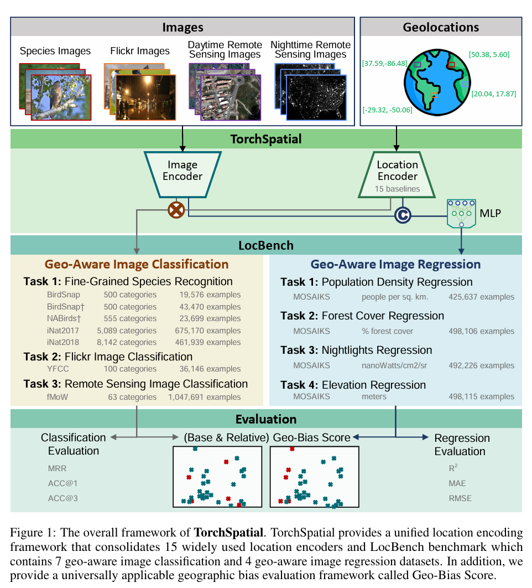

# TorchSpatial: A Location Encoding Framework and Benchmark for Spatial Representation Learning

🚧 Constructing...

## Data Download Instructions
The data can be downloaded from the following link:
[Download Data](https://www.dropbox.com/scl/fo/lsvb50zszhup2hylphdxc/AF84XwmulxVnLYJoouq_i_Q?rlkey=tc53scmvc48di52z1k9azzymk&st=ijkms1i1&dl=0)

Data should be organized following the ..

## Code Run
The example bash files for running the codes can be found in main/run_bash folder

## Image Datasets

### NABirds
Another image dataset about North American bird species constructed by Mac Aodha et al. (2019) based on the NABirds dataset (Van Horn et al., 2015) in which the location metadata were also simulated from the eBrid dataset (Sullivan et al., 2009).

**Download**: [NABirds Dataset](https://dl.allaboutbirds.org/nabirds)

### iNat2017
The species recognition dataset used in the iNaturalist 2017 challenges (Van Horn et al., 2018) with 5089 unique categories.

**Validation Split**: [iNat2017 Validation Split](https://github.com/visipedia/inat_comp/blob/master/2017/README.md)

### iNat2018
The species recognition dataset used in the iNaturalist 2018 challenges (Van Horn et al., 2018) with 8142 unique categories.

**Validation Split**: [iNat2018 Validation Split](https://github.com/visipedia/inat_comp/tree/master/2018)

### YFCC
Yahoo Flickr Creative Commons 100M dataset (YFCC100M-GEO100 dataset), which is a set of geo-tagged Flickr photos collected by Yahoo! Research. Here, we denote this dataset as YFCC. YFCC has been used in Tang et al. (2015); Mac Aodha et al. (2019) for geo-aware image classification.

**Download**: [YFCC Dataset](https://github.com/visipedia/fg_geo)

### fMoW
We use the Functional Map of the World dataset (denoted as fMoW) (Klocek et al., 2019) as one representative remote sensing (RS) image classification dataset. The fMoW dataset contains about 363K training and 53K validation remote sensing images which are classified into 62 different land use types. They are 4-band or 8-band multispectral remote sensing images. 4-band images are collected from the QuickBird2 or GeoEye-1 satellite systems while 8-band images are from WorldView-2 or WorldView-3. We use the fMoWrgb version of fMoW dataset which are JPEG compressed version of these remote sensing images with only the RGB bands. The reason we pick fMoM is that 1) the fMoW dataset contains RS images with diverse land use types collected all over the world (see Figure 8c and 8d); 2) it is a large RS image dataset with location metadata available. In contrast, the UC Merced dataset (Yang and Newsam, 2010) consist of RS images collected from only 20 US cities. The EuroSAT dataset (Helber et al., 2019) contained RS images collected from 30 European countries. And the location metadata of the RS images from these two datasets are not publicly available. Global coverage of the RS images is important in our experiment since we focus on studying how the map projection distortion problem and sphericalto-Euclidean distance approximation error can be solved by Sphere2Vec on a global scale geospatial problem. The reason we use the RGB version is that this dataset version has an existing pretrained image encoder – MoCo-V2+TP (Ayush et al., 2020) available to use. We do not need to train our own remote sensing image encoder.

**Download**: [fMoW Dataset](https://github.com/fMoW/dataset)

